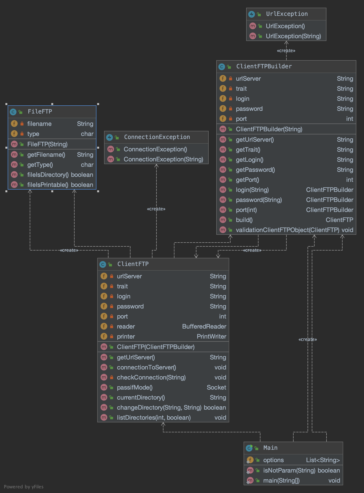

## Tree FTP 

**Auteur** : Nicolas Fernandes, nicolas.fernandes.etu@univ-lille.fr <br>
01/02/21 <br>
[lien vidéo](./src/main/resources/video_treeFTP.mp4)

### Presentation du projet : 

**Tree FTP** est un programme codé en Java qui permet de lister le contenu d'un serveur FTP distant grâce au protocole [File Transfer Protocole](https://fr.wikipedia.org/wiki/File_Transfer_Protocol) (FTP). 
Le listing du serveur se base sur la [commande](http://www.delafond.org/traducmanfr/man/man1/tree.1.html) `tree` a quelques détails prêt.
Le logiciel peut etre appelé avec des paramètres, comme la profondeur a laquelle nous voulons lister les fichiers,
du serveur ou l'affichage des fichiers cachés.

*(Aperçu du resultat de TreeFTP)*
```
├── cdimage
│    ├── bionic
│    │    ├── daily-live
│    │    │    ├── 20200805
│    │    │    ├── 20200806
│    │    │    ├── 20200806.1
│    │    │    ├── 20200806.1
│    │    │    └── 20200806.1
│    │    └── ../source/bionic/source
│    ├── cdicons
│    │    ├── folder.png
│    │    ├── img.png
│    │    ├── iso.png
│    │    ├── jigdo.png
│    │    ├── kubuntu-folder.png
```

### Utilisation :

Pour lancer l'application il suffit de se placer dans le répertoire où se trouve le jar,
et de taper :
```
    java -jar TreeFtp.jar NomDuServerFTP -p=2
```
Certains serveurs FTP permettent la connexion en tant que visiteur, cependant, d'autre peuvent nécessiter un login et un mot de passe.
Dans ce cas il faut écrire le login et le mot de passe à la suite du nom du serveur :
```
    java -jar TreeFtp.jar NomDuServerFTP VotreLogin VotreMotDePasse -p=2
```

Pour la profondeur souhaitée, il est nécessaire d'ajouter l'option `-p={profondeur}`,
si vous voulez afficher l'arborescence sans limite de profondeur il suffit de mettre ce paramètre a -1 `-p=-1`. <br>
**ATTENTION** si votre serveur FTP contient beaucoup de fichier et que vous ne limitez pas la profondeur, le resultat du programme peut-être très long.

```
    java -jar TreeFtp.jar NomDuServerFTP VotreLogin VotreMotDePasse -p=4
```


Vous pouvez activer l'affichage des fichiers cachés avec l'option `-a` :
```
    java -jar TreeFtp.jar NomDuServerFTP VotreLogin VotreMotDePasse -p=2 -a
```

### Architecture :



### Lister et expliquer la gestion d'erreur :

Dans ce projet, il y a plusieurs Classe qui extends Exception.
ConnectionException : permet de relever les erreurs durant la connection et l'authentification du serveur.
UrlException : permet de verifier que l'url du serveur est bien passé en paramètre.

Ensuite j'utilise un try/catch pour afficher une erreur lorsqu'il y a un probleme avec la connection de la socket (nom de domaine ou port incorrect).
 
### Code samples :

On peut voir ici une partie du code de la fonction recursif listDirectories.
Elle liste le repertoire courant et pour chaque fichier la classe file nous permet de savoir
le type de fichier. Dans tous les cas le fichier est affiché mais si le fichier est un repertoire alors on rentre dans celui ci
et on appelle listDirectory pour le lister. 

```
if (hideFile)
    printer.println("LIST -a");
else
    printer.println("LIST ");

[...]

while (files != null) {
    FileFTP f = new FileFTP(files);
    files = dataReader.readLine();

    if(f.fileIsPrintable() && files == null)
        System.out.println(trait + "└── " + f.getFilename());
    else if (f.fileIsPrintable())
        System.out.println(trait + "├── " + f.getFilename());

    if (f.fileIsDirectory()) {
        if (this.changeDirectory(f.getFilename(), currentDir) && f.fileIsPrintable()) {
            trait += "│    ";
            if (depth != 0) this.listDirectories(depth - 1, hideFile);
            trait = trait.substring(0,trait.length()-5);
        }
    }
}
```